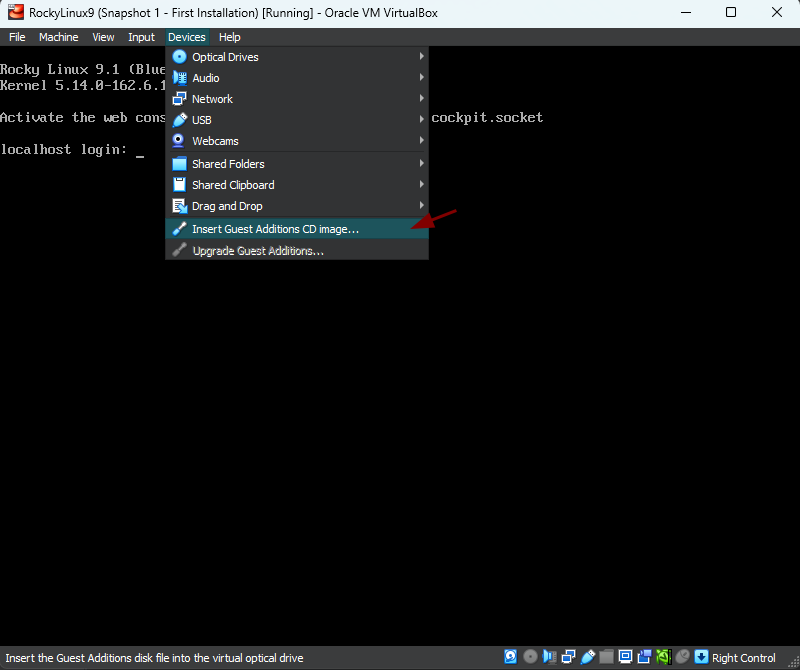

# Create a vbox base Rocky Linux 9

Create a user vagrant:
```
useradd vagrant 
passwd vagrant
```
---

Update system and install epel-release repository:
```
sudo dnf update -y
sudo dnf install -y epel-release
```

Install packages to update kernel
```
sudo dnf install -y gcc make perl kernel-devel kernel-headers bzip2 dkms
sudo dnf update -y kernel-*
```

Insert the "Guest Additions CB Image..."



Mount the media:
```bash
sudo mkdir -p /mnt/cdrom
sudo mount /dev/cdrom /mnt/cdrom
```

Install the Guest Additions running command **VboxLinuxAdditions.run**
```bash
cd /mnt/cdrom
sudo sh ./VBoxLinuxAdditions.run --nox11
```

```bash
sudo reboot
```
\
Add the line to user vagrant on **/etc/sudoers**

```bash
sudo update-alternatives --config editor
```

```bash
sudo visudo
```

```bash
vagrant ALL=(ALL)  NOPASSWD:ALL
```

### Install the ssh public key
```bash
mkdir -p /home/vagrant/.ssh

wget --no-check-certificate https://raw.github.com/mitchellh/vagrant/master/keys/vagrant.pub -O /home/vagrant/.ssh/authorized_keys

chmod 0700 /home/vagrant/.ssh

chmod 0600 /home/vagrant/.ssh/authorized_keys

chown -R vagrant  /home/vagrant/.ssh
```

### OpenSSH Server configuration
```bash
sudo vim /etc/ssh/sshd_config
```

Ajust the file 
```bash
Port 22
PubKeyAuthentication yes
AuthorizedKeysFile %h/.ssh/authorized_keys
PermitEmptyPasswords no
```

Restart the OpenSSH Server
```bash
sudo service ssh restart
sudo service sshd restart
```

### Finally, let's clean the machine to be as dry as possible
```bash
sudo dnf clean all

sudo dd if=/dev/zero of=/EMPTY bs=1M
sudo rm -f /EMPTY

cat /dev/null > ~/.bash_history && history -c && exit
```

Poweroff the machine
```bash
init 0
```

### Packaging vm with the following command
```bash
vagrant package --base RockyLinux9 --output RockyLinux9.box
```

The RockyLinux9.box file will be in the current directory
```bash
RockyLinux9.box
```

To add the box just
```bash
vagrant box add --name RockyLinux9 RockyLinux9.box
```

```bash
vagrant box list 
```

Referência:
https://blog.ycshao.com/2017/09/16/how-to-upload-vagrant-box-to-vagrant-cloud/#:~:text=box%20file%20in%20your%20folder,and%20click%20%E2%80%9CCreate%20box%E2%80%9D.