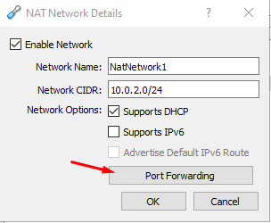
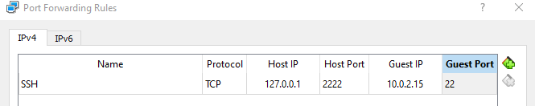
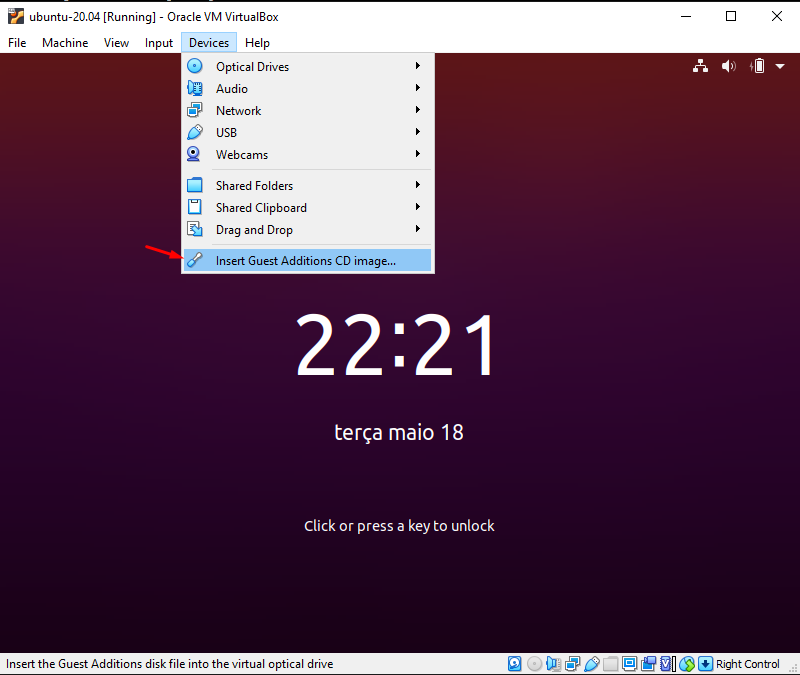
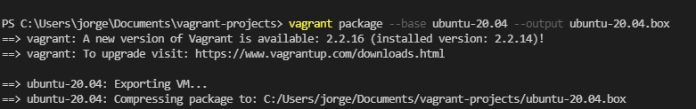
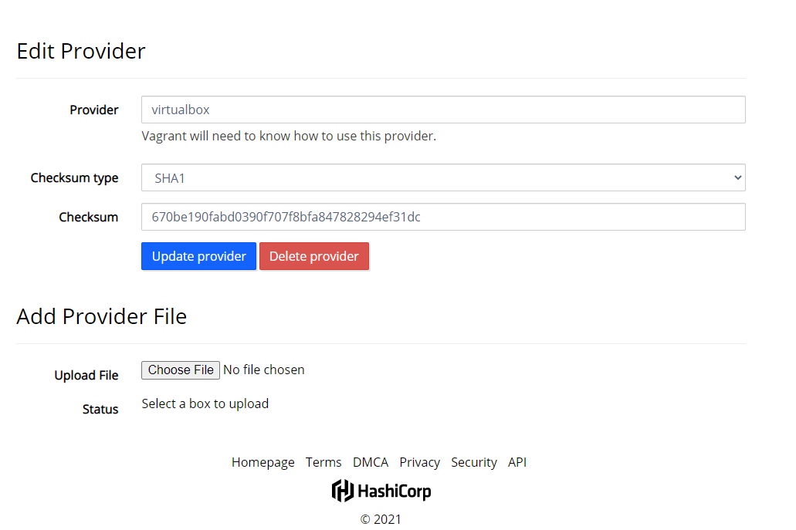

# Build a VagrantBox

In this tutorial, we go to build a vagrantbox base Ubuntu 20.04. The provider will be Oracle Virtualbox and we will build a box based on Ubuntu Desktop 20.04.

The steps will be:
- Download of ISO on https://ubuntu.com/download;
- Create a vm on Oracle Virtualbox;
- Add Guest Additions and configure it;
- Configuring Portforward in this vm;
- Prepare the vm to build a lean box;
- Create a box;
- Test;
- Publish the box on VagrantCloud.

## Configuring Portforward in this vm

### In File - Preferences - Network






## Prepare the vm to build a lean box

### Add Guest Additions and configure it



### Configuring Virtualbox Additions
```bash
sudo apt install -y build-essential dkms
```

```bash
sudo mount /dev/cdrom /media
sudo /media/VBoxLinuxAdditions.run
```

### System update
```bash
sudo apt update -y
sudo apt list --upgradable
sudo apt upgrade -y
```

### Adjust */etc/sudoers*
```bash
sudo update-alternatives --config editor
visudo
```

```bash
vagrant ALL=(ALL)  NOPASSWD:ALL
```
### Install *openssh-server*
```bash
apt install -y openssh-server
systemctl enable --now sshd
```


### Configure vagrant insecure key
```bash
mkdir -p /home/vagrant/.ssh
wget --no-check-certificate https://raw.github.com/mitchellh/vagrant/master/keys/vagrant.pub -O /home/vagrant/.ssh/authorized_keys
chmod 0700 /home/vagrant/.ssh
chmod 0600 /home/vagrant/.ssh/authorized_keys
chown -R vagrant  /home/vagrant/.ssh
```

### SSH configure
```bash
Port 22
PubkeyAuthentication yes
AuthorizedKeysFile      %h/.ssh/authorized_keys
PermitEmptyPasswords no
```

### Clean the vm
```bash
sudo apt autoremove
sudo apt autoclean
sudo apt clean
sudo dd if=/dev/zero of=/EMPTY bs=1M
sudo rm -f /EMPTY
cat /dev/null > ~/.bash_history && history -c && exit
```

### List the vms with *VBoxManage list*
```bash
VBoxManage list vms
```

### Create the box with the follow command
```bash
vagrant package --base ubuntu-20.04 --output ubuntu-20.04.box
```


### And add the box to the list of available boxes
```bash
vagrant box add ubuntu-20.04 ubuntu-20.04.box
```

### Generate a checksum to box
```bash
sha1sum ubuntu-20.04.box
```
### Publish the vagrant cloudless box


