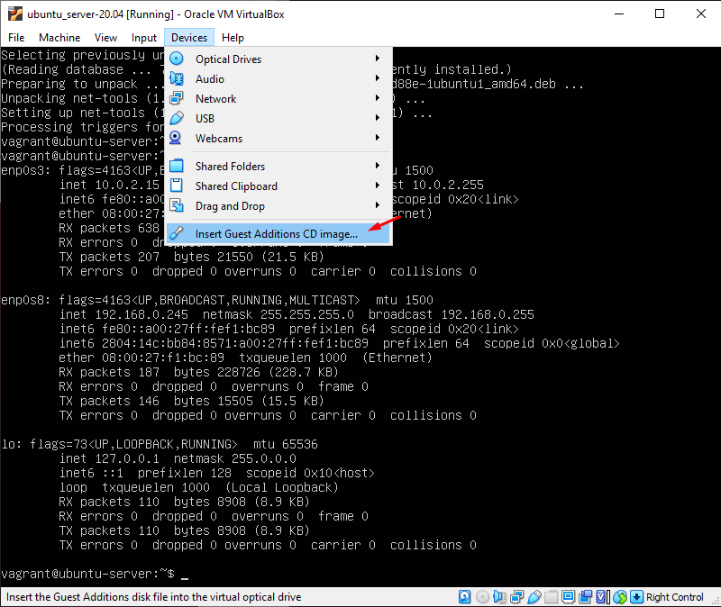

# Create a vbox base Ubuntu 20.04

```
sudo apt update
sudo apt install -y build-essential linux-headers-$(uname -r)
```




```bash
sudo mount /dev/cdrom /media
```

Install the Guest Additions running command **VboxLinuxAdditions.run**
```bash
cd /media
sudo ./VBoxLinuxAdditions.run
```

```bash
sudo reboot
```
\
Add the line to user vagrant on **/etc/sudoers**

```bash
sudo vim /etc/sudoers
```

```bash
vagrant ALL=(ALL)  NOPASSWD:ALL
```

### Install the ssh public key
```bash
mkdir -p /home/vagrant/.ssh

wget --no-check-certificate https://raw.github.com/mitchellh/vagrant/master/keys/vagrant.pub -O /home/vagrant/.ssh/authorized_keys

chmod 0700 /home/vagrant/.ssh

chmod 0600 /home/vagrant/.ssh/authorized_keys

chown -R vagrant  /home/vagrant/.ssh
```

### OpenSSH Server configuration
```bash
sudo apt-get install -y openssh-server
sudo vi /etc/ssh/sshd_config
```

Ajust the file 
```bash
Port 22
PubKeyAuthentication yes
AuthorizedKeysFile %h/.ssh/authorized_keys
PermitEmptyPasswords no
```

Restart the OpenSSH Server
```bash
sudo service ssh restart
sudo service sshd restart
```

Poweroff the machine
```bash
init 0
```

Export the vm with the following command
```bash
vagrant package --base ubuntu-desktop_20.04
```

The package.box file will be in the current directory
```bash
package.box
```

To add the box just
```bash
vagrant box add --name ubuntu_desktop-20.04 package.box
```

```bash
vagrant box list
```